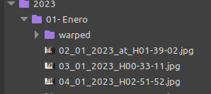

# Requisitos
  
Se necesitan tener las siguientes librerias instaladas:  
  
+ OpenCV  
+ Numpy
+ [face_recognition](https://github.com/ageitgey/face_recognition/)
+ Pillow (*opcional* solo se usa en algunas funciones de debugging y prueba)

# Como usar

Este script toma una carpeta que tiene la siguiente estructura:  

una imagen a la que se desean transformar (*SOURCE IMAGE*) y otra del subject (*SUBJECT_IMAGE*)
  
El script  [EveryDayPic](EvrydayPic.py) encuentra una homografia entre las imagenes de la carpeta y el source, las transformas y las guarda en la carpeta deseada

Se recomienda dar un vistazo a los recursos dejados en *sources.md* pues allí se explican como se usan las funciones de openCV y face recognition, además se dan ejemplo utiles.

## Configuracion y explicacion de variables  

+ **WRITE_BLEND** determina si se guarda una imagen mezclando source y el objetivo además del objetivo transformado

+ **SOURCE_IMAGE** es la imagen que determina como van a hacerse las homografias, es decir como se van a transformar las imagenes. Dicho de otra manera toda imagen se mueve para que el rostro del subject coincida con la posicion del mismo en SOURCE_IMAGE. Se recomienda usar una imagen en la que el rostro se vea lo mejor posible y de la manera más *"plana"*

+ **SUBJECT_IMAGE** imagen que contiene unicamente a subject, es usada para sacar las caracteristicas de este y poder reconocerlo. Se recomienda usar una imagen en la que se vea bien el rostro, con cejas, ojos nariz y boca descubiertos

+ **MODEL_SIZE** determina que tipo de modelo de face_recognition es usado para los landmarks [mas informacion](https://face-recognition.readthedocs.io/en/latest/face_recognition.html#face_recognition.api.face_landmarks)

+ **ROOT_FOLDER** es la carpeta que contiene las carpetas de los meses y sus fotos

+ **OUTPUT_FOLDER** es la carpeta donde se desean guardar las imagenes transformadas, en el codigo se asume que  se encuentra en la carpeta del mes y se llama *warped/*
  
+ **MONTHS** son los nombres de las carpetas en ROOT_FOLDER a las que se les desea transformar la imagen

# Desarrollo a futuro/ por mejorar

+ para las rutas usar librerias como PATH o OS, ya que como esta el script solo sirve en linux

+ usar en lo posible arrays de numpy, que son mas veloces y evitan que se tenga que sobrescribir y mover datos en la memoria.

+ limitar las homografias, pues en algunas casos la transformacion es *"muy fuerte"* haciendo que la imagen se deforme y los rostros se vean extraños  